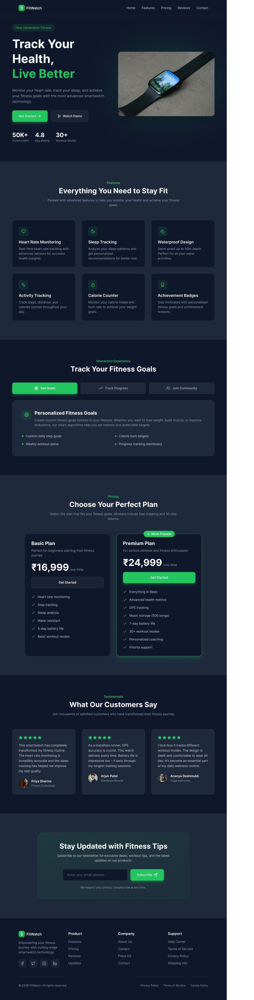

# ⌚ FitWatch - Smart Fitness Watch Landing Page

A modern and fully responsive **Smart Fitness Watch Landing Page** built using **HTML, CSS, and Vanilla JavaScript**.
This project focuses on clean UI/UX, responsive layouts, and modern frontend development practices.

---

## 🚀 Features

* ✅ Fully Responsive Design
* ✅ Mobile-First Layout
* ✅ Modern Dark UI
* ✅ Interactive Goal Section
* ✅ Pricing Cards
* ✅ Testimonials Section
* ✅ Email Subscription Form
* ✅ Mobile Navigation Toggle
* ✅ Hover Effects & Smooth Transitions
* ✅ Clean and Structured Code

---

## 🛠️ Tech Stack

* HTML5
* CSS3
* Vanilla JavaScript

---

## 📱 Responsive Design

The website is optimized for:

* Mobile Devices
* Tablets
* Desktop Screens

---

## 📸 Website Preview



---

## 📂 Folder Structure

```bash
Watch_Landing_Page/
│── index.html
│── style.css
│── script.js
│── README.md
│
└── assets/
    └── Smart Fitness Watch Landing Page (1).png
```

---

## ⚙️ JavaScript Functionalities

* Mobile Navbar Toggle
* Interactive Goal Tabs
* Email Form Validation

---

## 🎨 UI Highlights

* Modern Dark Theme
* Neon Green Accent Colors
* Responsive Grid Layouts
* Soft Shadows & Hover Animations
* Clean Typography
* Consistent Spacing System

---

## 📌 Project Purpose

This project was built for frontend development practice to improve skills in:

* Responsive Web Design
* Vanilla JavaScript
* CSS Layout Techniques
* UI/UX Design Fundamentals

---

## 👨‍💻 Author

**Harsh Udar**

GitHub: https://github.com/HarshUdar18

---

## ⭐ Support

If you like this project, consider giving it a ⭐ on GitHub!
